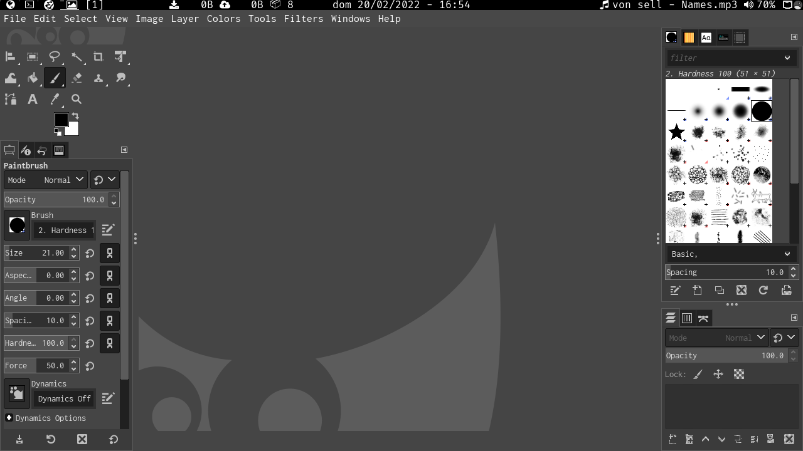

# Minha build minimalista do dwm

**Build sem nenhum patch referente a barra**

**Controlada usando [sxhkd](https://github.com/LucasTavaresA/dotfiles/blob/main/.config/sxhkd/sxhkdrc)**

## Patches

**Você pode retirar patches usando o comando "patch -R < arquivopatch.diff", não garanto que vá funcionar sem ajustes posteriores no código**

- Troca em ciclo de layouts ([layoutscroll](https://dwm.suckless.org/patches/layoutscroll/))

- Modo bottom stack ([bottomstack](https://dwm.suckless.org/patches/bottomstack/))

- Foco com clique do mouse ([focusonclick](https://dwm.suckless.org/patches/focusonclick/))

- Modo sem bordas quando só tem uma janela visível ([removeborder](https://dwm.suckless.org/patches/removeborder/))

- Ajustamento de bordas pela borda mais próxima do cursor ([resizepoint](https://github.com/bakkeby/patches/blob/master/dwm/dwm-resizepoint-6.2.diff))

- Salvamento de posição e tamanho de janelas flutuantes ([save floats](https://dwm.suckless.org/patches/save_floats/))

- regra que centraliza janelas ([center](https://dwm.suckless.org/patches/center/))

- Borda vermelha em janelas urgentes ([urgentborder](https://dwm.suckless.org/patches/urgentborder/))

- Diferentes layouts para cada tag ([pertag](https://dwm.suckless.org/patches/pertag/))

- ([scratchpads](https://dwm.suckless.org/patches/scratchpads/))

- Programas abertos pelo terminal tomam o lugar do mesmo ate serem fechados ([swallow](https://dwm.suckless.org/patches/swallow/))

- Mudar tamanho de janelas dentro da stack ([cfacts](https://dwm.suckless.org/patches/cfacts/))

- Manda sinais para executar funções do dwm ([dwmc](https://dwm.suckless.org/patches/dwmc/))

- Conserta borda piscando ao trocar de janelas ([noborderflicker](https://dwm.suckless.org/patches/noborderflicker/))
